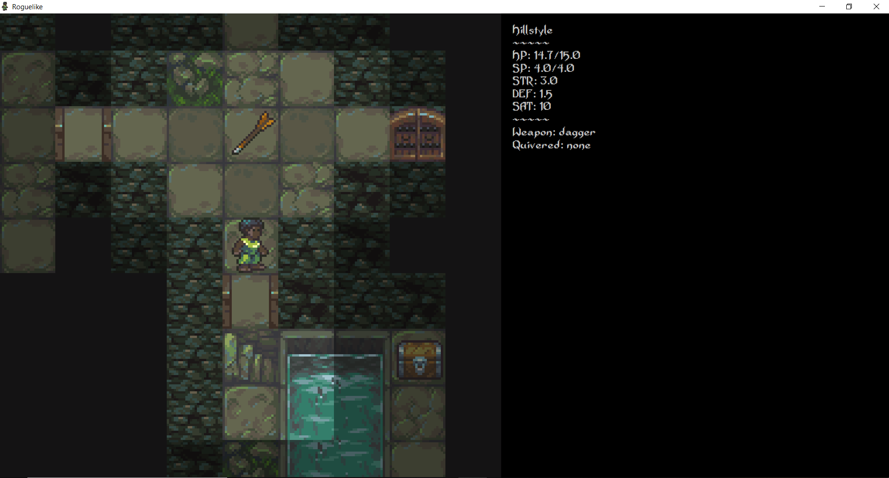
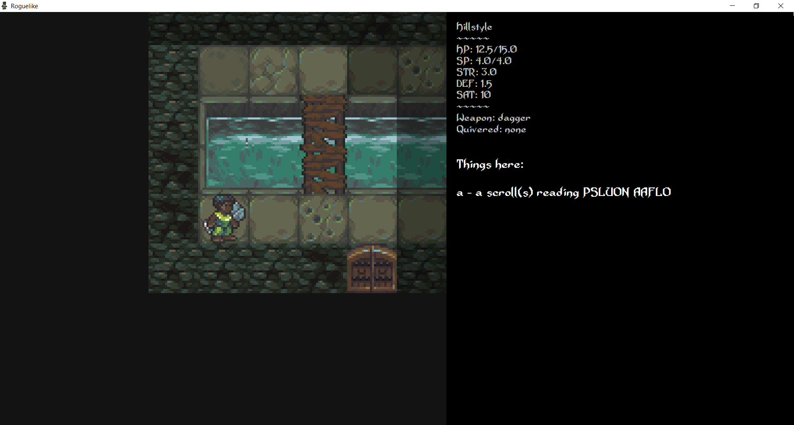
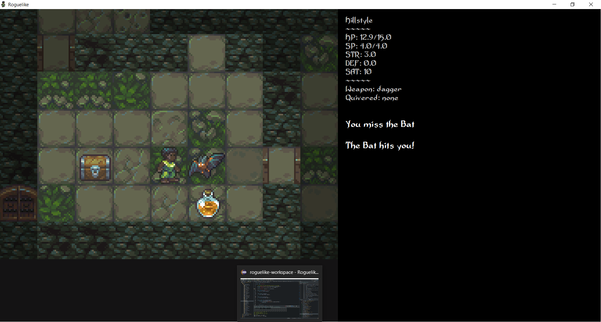
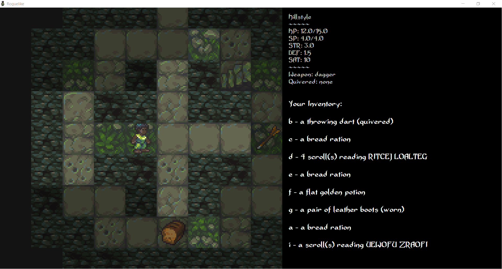
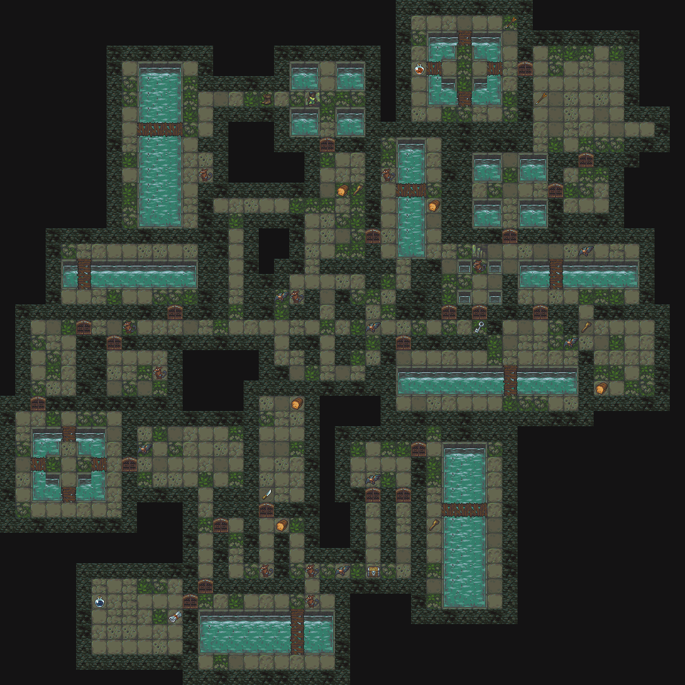

# Roguelike in Java

Working on a [roguelike](http://www.roguebasin.com/index.php?title=Main_Page) from scratch in java as a hobby.

Artwork is original/modified tilesets from [Arachne](https://forums.tigsource.com/index.php?topic=14166.0)
([CC non-commercial license](https://creativecommons.org/licenses/by-nc-sa/4.0/))

FOV Algorithm is an interpretation from [SquidLib](https://github.com/SquidPony/SquidLib)
([License here](https://github.com/SquidPony/SquidLib/blob/master/LICENSE.txt))

Project revived. I am spending most of my time right now refactoring old messy code/systems, so please excuse any bad legacy code (particularly the Map, MapType, StaticEntity, and View classes).

